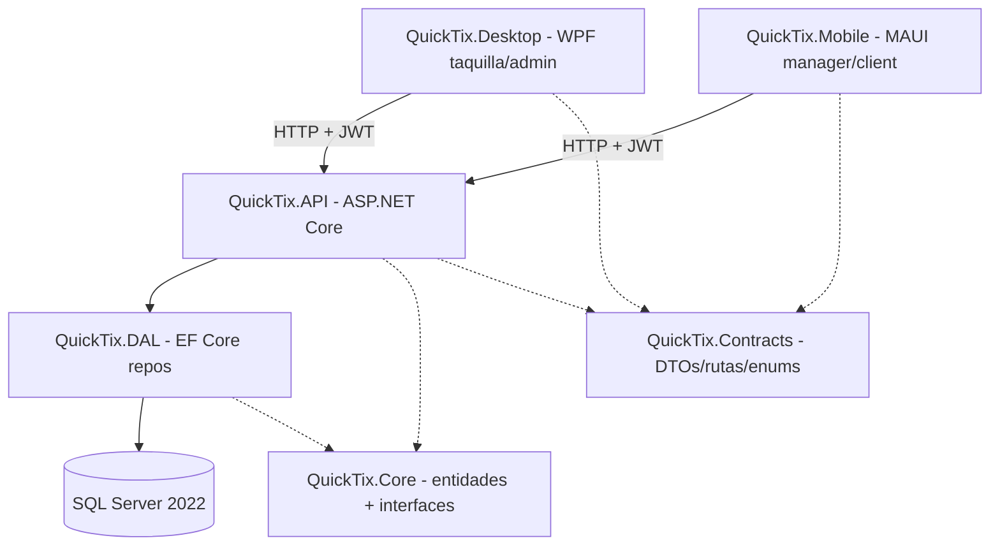
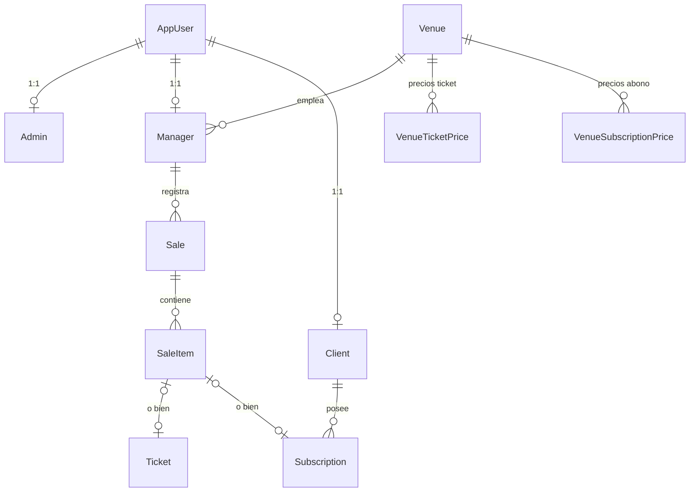

<!-- docs: ARCHITECTURE.md v1.0.0 — 2026-07-03 — bootstrap inicial de project-docs -->

# Architecture: QuickTix

## System Overview

Solución .NET 8 por capas: una Web API central (ASP.NET Core + EF Core sobre SQL Server)
consumida por HTTP por dos clientes nativos — WPF para taquilla/administración y MAUI
(Android) para managers y abonados. El proyecto `Contracts` es el contrato compartido
(DTOs, envelope de respuesta, enums, rutas) entre servidor y clientes.



## Tech Stack

| Layer | Technology | Version | Rationale |
|---|---|---|---|
| API | ASP.NET Core Web API | .NET 8 | Stack aprendido en DAM; ecosistema maduro |
| ORM | EF Core + SQL Server | 8.0.8 | Migraciones, change tracking; SQL Server por familiaridad del ciclo |
| Auth | ASP.NET Identity + JWT Bearer | 8.0.8 | Gestión de usuarios/roles integrada; JWT para clientes nativos |
| Mapping | AutoMapper | 12.0.1 | Entidad ↔ DTO centralizado en un profile |
| API docs | Swashbuckle (Swagger) | 6.5.0 | Exploración de la API en desarrollo |
| Desktop | WPF + WPF-UI (Fluent) | 3.0.5 | App de taquilla Windows con estética moderna |
| Mobile | .NET MAUI (Android) | net8.0-android | Un solo lenguaje en todo el stack |
| MVVM | CommunityToolkit.Mvvm | 8.3/8.4 | Source generators, mínimo boilerplate |
| Tests | xUnit + SQLite in-memory | 2.9.3 | Ver ADR-005 |
| Infra dev | Docker Compose | — | SQL Server 2022 en contenedor |

## Module Map

```
QuickTix.sln
├── QuickTix.API/        # Web API: controllers, filtros, extensiones, AutoMapper, Program.cs
├── QuickTix.Core/       # Dominio: entidades (Models/Entities/) e interfaces de repos (Interfaces/)
├── QuickTix.DAL/        # Datos: ApplicationDbContext, Repositories/, Migrations/, AppDbSeeder
├── QuickTix.Contracts/  # Contrato compartido: DTOs/, Common/ApiResponse, Enums/, Routes/, Validation/
├── QuickTix.Desktop/    # WPF: ViewModels/ (Base/BaseCrudViewModel), Views/Pages/, Services/ (HttpJsonClient)
├── QuickTix.Mobile/     # MAUI: Shells/ por rol, Views/{Client,Manager}/, Services/, Helpers/ (AppSession, JwtClaimReader)
└── QuickTix.Tests/      # xUnit: tests de integración sobre SQLite in-memory
```

## Layer Contracts

Qué puede referenciar qué (referencias de proyecto):

- `Contracts` no referencia nada. `Core` → solo `Contracts`. `DAL` → `Core` + `Contracts`.
  `API` → `DAL` + `Core` + `Contracts`.
- **Clientes**: la forma correcta es la de `Mobile` → solo `Contracts` + `Core`. Los clientes
  hablan con el servidor exclusivamente por HTTP.
- ⚠️ **Violación conocida**: `Desktop` referencia hoy `API`, `DAL` y `Core` directamente.
  Es deuda, no diseño — pendiente de corregir (ver PROGRESS.md). No añadir código nuevo en
  Desktop que use tipos de DAL/API.
- La lógica de negocio vive hoy repartida entre controllers y repositorios; **no existe capa
  de servicios**. Su posible introducción está en decisión pendiente (junto con la frontera
  de transacción, ADR-002).

## Data Model

Entidades principales y relaciones (simplificado):



- `AppUser` extiende `IdentityUser` (añade `Name`, `Nif`, `MustChangePassword`); Admin/Manager/Client
  son perfiles 1:1 sobre él (`DeleteBehavior.Restrict`).
- Los precios son por combinación única: `(VenueId, Type, Context)` para tickets y
  `(VenueId, Category, Duration)` para abonos, con índices únicos compuestos.
- `Sale.TotalAmount` es propiedad calculada (no mapeada); el importe real vive en las líneas.
- Dinero: `decimal` con `HasPrecision(18,2)` en todas las columnas monetarias.

## Key Patterns

### CRUD genérico en API
`BaseController<TEntity, TDto, TCreateDto>` (`QuickTix.API/Controllers/BaseController.cs`)
da GetAll/Get/Create/Update/Delete virtuales con `[Authorize]`; los hijos añaden roles y
overrides. Controllers que no encajan (agregados, solo lectura) no lo heredan y documentan
el porqué (`PricingController`, `SaleItemController`, `UserController`).

### Envelope de respuesta
`ApiResponse<T>` (`QuickTix.Contracts/Common/ApiResponse.cs`) en el 100% de los endpoints,
con `TraceId` para correlación. Errores centralizados en `ApiExceptionFilter`
(`QuickTix.API/Filters/`), que traduce excepciones (incluidos errores SQL 2601/2627) a HTTP
status + mensaje en español. Ver ADR-003.

### Acceso a datos
Repositorio por entidad implementando `IRepository<TEntity>` (`QuickTix.Core/Interfaces/`),
sin clase base común y sin Unit of Work: **cada repo posee su frontera de transacción**
(`SaveAsync` propio). Ver ADR-002 — decisión bajo revisión, no "corregir" sin pasar por ella.
Cachés `IMemoryCache` puntuales en repos de lectura frecuente (Ticket, Sale, Pricing).

### Ventas
Las operaciones de venta (`SaleRepository.SellTickets*/SellSubscription*`) construyen el
agregado completo (Sale + Items + Ticket/Subscription) en memoria y persisten con un único
`SaveChangesAsync`. El invariante "venta fallida no persiste nada" está protegido por test
(`QuickTix.Tests/Sales/SellTicketsBatchTests.cs`).

### Clientes HTTP
`HttpJsonClient` casi idéntico en ambos clientes (`Services/HttpsJsonClient.cs`) + `TokenStore`
+ rutas desde `ApiRoutes` (`QuickTix.Contracts/Routes/`). Ver ADR-004. Mobile navega por rol
con shells separadas (`Shells/AppShell_Manager.xaml` / `AppShell_Client.xaml`).

### Auth
Identity para usuarios/roles + JWT self-issued (HMAC-SHA256, 7 días, emitido hoy desde
`UserRepository.LoginAsync` — ubicación reconocida como deuda de capas). Hay un segundo
esquema bearer "JwtGoogle" registrado sin consumidor. Roles: `admin`, `manager`, `client`.

## Environment & Secrets

Estado actual (deuda conocida, bloqueante antes de piloto): `ApiSettings:SecretKey` (JWT) y
`ConnectionStrings:SqlConnection` viven en claro en `QuickTix.API/appsettings.json`, y la
password de SA en `docker-compose.yml`. El plan es migrar a user-secrets (dev) y variables
de entorno (producción). Hasta entonces: **no añadir ningún secreto nuevo a ficheros versionados**.

## Deploy & Environments

- **Desarrollo**: `docker compose up -d` (SQL Server) + `dotnet run --project QuickTix.API`.
  Kestrel escucha en `0.0.0.0:5137/7137` para que el emulador Android llegue vía `10.0.2.2`.
- **Producción**: no definida todavía (pendiente para fase de piloto). El Dockerfile de la
  API referenciado en docker-compose no existe de forma funcional a día de hoy.

## Security Considerations (estado actual)

- Passwords iniciales derivadas del NIF y política Identity en mínimos — deuda crítica pre-piloto.
- Password del usuario guardada en claro en ambos clientes (Settings/Preferences) — deuda crítica.
- JWT de 7 días sin refresh ni revocación; `RequireHttpsMetadata=false` sin condicionar a entorno.
- Validación de letra de NIF/NIE desactivada (`SpanishIdValidator` devuelve true).
- CORS: policy `QuickTixCors` (dev: localhost; prod: quicktix.es).

Las tareas de remediación viven en PROGRESS.md (tema seguridad), no aquí.

## ADRs

Las decisiones de arquitectura con su contexto completo están en `docs/ARCHITECTURE_ADRS.md`:

- ADR-001 — Solución por capas con Contracts compartido
- ADR-002 — Frontera de transacción en cada repositorio (bajo revisión)
- ADR-003 — Envelope propio `ApiResponse<T>` en lugar de ProblemDetails
- ADR-004 — Cliente HTTP artesanal + catálogo de rutas compartido
- ADR-005 — SQLite in-memory para tests de integración
